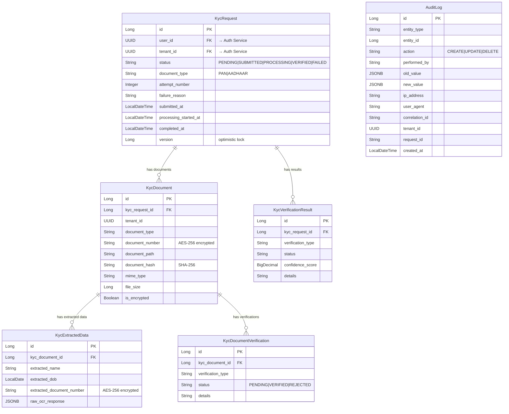

# KYC System — Project Documentation

> **Purpose**: This document describes the entire KYC (Know Your Customer) system — its architecture, domain model, APIs, security, integrations, and operational details. It is intended to be used as context when collaborating with other services (e.g., Auth Service, Order Service) in the microservices ecosystem.

---

## 1. Overview

The KYC System is a **multi-tenant, document verification microservice** built with Spring Boot 3.4.2 (Java 21). It handles the end-to-end lifecycle of identity document verification — from upload, through OCR extraction and automated verification, to report generation and email delivery.

### Key Capabilities
- **Document Upload & Storage**: Accepts PAN and Aadhaar documents (PDF, JPEG, PNG) with file validation
- **OCR Extraction**: Uses Tesseract (Tess4j) to extract name, DOB, and document numbers from uploaded images
- **Automated Verification**: Cross-references extracted data against Auth Service user profiles (name matching + DOB verification)
- **Audit Logging**: Full audit trail with JSON diff of entity changes (stored in PostgreSQL JSONB)
- **Report Generation**: Monthly PDF reports with breakdowns by status and document type, emailed via SMTP
- **Multi-Tenancy**: Tenant-scoped data isolation using `TenantContext` (thread-local) with superadmin bypass
- **In-Memory Queue**: Asynchronous processing pipeline decoupling upload from OCR

---

## 2. Tech Stack

| Layer | Technology |
|:---|:---|
| Runtime | Java 21, Spring Boot 3.4.2 |
| Database | PostgreSQL 18.3 |
| ORM | Hibernate 6 (JPA) |
| Migrations | Flyway |
| Security | Spring Security 6, JWT (jjwt 0.11.5), JWKS |
| OCR | Tesseract via Tess4j 5.11.0 |
| PDF | Flying Saucer (XHTMLRenderer) + OpenPDF |
| Caching | Redis / Valkey |
| API Docs | SpringDoc OpenAPI (Swagger UI) |
| Observability | Spring Actuator, Micrometer, Prometheus, Logstash Logback Encoder |
| Testing | JUnit 5, Testcontainers (PostgreSQL + Redis) |
| Build | Maven |

---

## 3. Architecture

### 3.1 High-Level Flow

```
Client (JWT) → KycController → KycOrchestrationService → KycQueueService
                                                              ↓
                                                          KycWorker (async)
                                                              ↓
                                                  ┌───────────┴───────────┐
                                                  ↓                       ↓
                                           OcrService             KycVerificationService
                                        (Tesseract OCR)        (Auth Service integration)
                                                  ↓                       ↓
                                        KycExtractedData       KycVerificationResult
                                                  └───────────┬───────────┘
                                                              ↓
                                                    Status: VERIFIED / FAILED
```

### 3.2 Package Structure

```
com.example.kyc_system/
├── KycSystemApplication.java          # Entry point
├── client/                            # External service clients
│   └── AuthServiceClient.java         # REST client for Auth Service
├── config/                            # Spring configuration
│   ├── SecurityConfig.java            # Security filter chain
│   ├── KycProperties.java             # Custom KYC properties
│   ├── RestTemplateConfig.java        # RestTemplate bean
│   ├── SwaggerConfig.java             # OpenAPI config
│   └── DataInitializer.java           # Startup data seeding
├── context/
│   └── TenantContext.java             # Thread-local tenant holder
├── controller/
│   └── KycController.java             # REST API (6 endpoints)
├── converter/
│   └── KycEncryptionConverter.java    # JPA attribute encryption
├── dto/                               # Data Transfer Objects
│   ├── AuthUserDTO.java               # Auth Service user profile
│   ├── KycMonthlyReportDTO.java       # Aggregate report data
│   ├── KycReportDataDTO.java          # Individual report rows
│   ├── KycRequestSearchDTO.java       # Search filter criteria
│   ├── OcrResult.java                 # OCR extraction output
│   └── ErrorResponse.java            # Standardized error body
├── entity/                            # JPA Entities
│   ├── BaseEntity.java                # createdAt, updatedAt
│   ├── KycRequest.java                # Core request entity
│   ├── KycDocument.java               # Uploaded document metadata
│   ├── KycExtractedData.java          # OCR-extracted fields
│   ├── KycDocumentVerification.java   # Per-document verification
│   ├── KycVerificationResult.java     # Overall verification result
│   └── AuditLog.java                  # Audit trail
├── enums/
│   ├── DocumentType.java              # PAN, AADHAAR
│   ├── KycStatus.java                 # PENDING → SUBMITTED → PROCESSING → VERIFIED/FAILED
│   └── VerificationStatus.java        # PENDING, VERIFIED, REJECTED
├── exception/
│   ├── BusinessException.java         # Domain exceptions
│   └── GlobalExceptionHandler.java    # @ControllerAdvice
├── filter/
│   ├── TenantResolutionFilter.java    # Resolves tenant from JWT/header
│   └── MdcLoggingFilter.java          # MDC context for structured logging
├── queue/
│   ├── KycQueueService.java           # In-memory BlockingQueue
│   ├── KycWorker.java                 # Async worker thread
│   └── KycQueueRecoveryService.java   # Recovers stuck PROCESSING requests on startup
├── repository/
│   ├── KycRequestRepository.java      # Extensive query methods
│   ├── KycDocumentRepository.java
│   ├── KycExtractedDataRepository.java
│   ├── KycVerificationResultRepository.java
│   ├── AuditLogRepository.java
│   └── specification/
│       └── KycRequestSpecification.java  # Dynamic JPA Criteria queries
├── scheduler/
│   └── KycReportScheduler.java        # Monthly cron + manual trigger
├── security/
│   ├── JwtAuthenticationFilter.java   # JWT validation filter (JWKS)
│   ├── JwtTokenProvider.java          # Token parsing utilities
│   ├── JwksKeyProvider.java           # Fetches public keys from Auth Service
│   ├── SecurityService.java           # Access control logic
│   ├── CustomAuthenticationEntryPoint.java  # 401 handler
│   └── CustomAccessDeniedHandler.java       # 403 handler
├── service/                           # Service interfaces
│   ├── KycRequestService.java
│   ├── KycDocumentService.java
│   ├── KycVerificationService.java
│   ├── KycExtractionService.java
│   ├── KycReportService.java
│   ├── KycReportPdfService.java
│   ├── AuditLogService.java
│   └── OcrService.java
│   └── impl/                          # Service implementations
│       ├── KycOrchestrationService.java     # Orchestrates the full KYC pipeline
│       ├── KycRequestServiceImpl.java       # Request CRUD + report data enrichment
│       ├── KycDocumentServiceImpl.java      # Document storage + validation
│       ├── KycVerificationServiceImpl.java  # Name/DOB matching against Auth Service
│       ├── KycExtractionServiceImpl.java    # OCR result persistence
│       ├── KycReportServiceImpl.java        # Report data aggregation
│       ├── KycReportPdfServiceImpl.java     # HTML→PDF rendering
│       ├── KycReportEmailServiceImpl.java   # Email delivery
│       ├── AuditLogServiceImpl.java         # Audit trail persistence
│       └── OcrServiceImpl.java              # Tesseract OCR integration
└── util/
    ├── EncryptionUtil.java             # AES-256-CBC encryption/decryption
    ├── KycFileValidator.java           # File type + size validation
    ├── MaskingUtil.java                # Document number masking for admins
    └── PasswordUtil.java               # Password hashing utilities
```

---

## 4. Domain Model (Database Schema)

### 4.1 Entity Relationship



### 4.2 Identity Fields

> [!IMPORTANT]
> `userId` and `tenantId` are stored as **native PostgreSQL `uuid` columns** and mapped to `java.util.UUID` in Java entities with `@JdbcTypeCode(SqlTypes.UUID)`. These are **foreign references to the Auth Service** — no local User or Tenant tables exist in this database.

---

## 5. API Endpoints

**Base Path**: `/api/kyc`  
**Auth**: All endpoints require a valid JWT Bearer token (except Swagger/Actuator).

| Method | Path | Auth | Description |
|:---|:---|:---|:---|
| `POST` | `/upload` | `@securityService.canAccessUser(userId)` | Upload a KYC document for verification |
| `GET` | `/status/{userId}` | `@securityService.canAccessUser(userId)` | Get latest KYC status for a user |
| `GET` | `/status/all/{userId}` | `@securityService.canAccessUser(userId)` | Get full KYC request history for a user |
| `GET` | `/search` | `ROLE_ADMIN` | Search/filter KYC requests (paginated) |
| `POST` | `/report` | `ROLE_ADMIN`, `ROLE_TENANT_ADMIN`, `ROLE_SUPER_ADMIN` | Generate and email a KYC report |

### Upload Request (Multipart)

```
POST /api/kyc/upload
Content-Type: multipart/form-data

Fields:
  userId:        String (UUID format)
  documentType:  AADHAAR | PAN
  file:          Binary (PDF, JPEG, PNG; max 10MB)
  documentNumber: String (e.g., "123456789012")
```

### Status Response

```json
{
  "requestId": 1,
  "status": "VERIFIED",
  "failureReason": "",
  "attemptNumber": 1,
  "submittedAt": "2026-04-01T10:30:00",
  "documentType": "AADHAAR",
  "extractedName": "John Doe",
  "extractedDob": "1990-01-15",
  "extractedDocumentNumber": "XXXX-XXXX-9012"
}
```

---

## 6. Security Model

### 6.1 Authentication Flow

1. Client sends JWT in `Authorization: Bearer <token>` header
2. `JwtAuthenticationFilter` validates the token using **JWKS** (public keys fetched from Auth Service at `/.well-known/jwks.json`)
3. Extracts claims: `sub` (userId), `tenantId`, `roles`
4. Prefixes roles with `ROLE_` for Spring Security compatibility (e.g., `ADMIN` → `ROLE_ADMIN`)
5. Sets `Authentication` in `SecurityContextHolder` with `userId` and `tenantId` in details map

### 6.2 Role Hierarchy

| Role | Scope | Capabilities |
|:---|:---|:---|
| `USER` | Own data only | Upload documents, check own status |
| `ADMIN` | Tenant-scoped | Search all users in tenant, generate reports |
| `TENANT_ADMIN` | Tenant-scoped | Same as ADMIN + tenant management |
| `SUPER_ADMIN` | Global | Full access, bypasses tenant scoping |

### 6.3 Access Control (`SecurityService`)

- **Self-access**: Any authenticated user can access their own data
- **Tenant-scoped access**: ADMIN/TENANT_ADMIN can access users **within their own tenant** (validated by calling Auth Service `GET /api/v1/users/{userId}` and comparing `tenantId`)
- **Global access**: SUPER_ADMIN bypasses all tenant checks

### 6.4 Multi-Tenancy (`TenantContext`)

- Uses `InheritableThreadLocal<String>` to propagate tenant ID across threads
- Set by `TenantResolutionFilter` (after JWT auth) from JWT claims or `X-Tenant-ID` header
- SUPER_ADMIN gets special constant `"SUPER_ADMIN"` (bypasses tenant filtering)
- **Always cleared** in `finally` block to prevent thread pool leaks

---

## 7. Auth Service Integration

> [!IMPORTANT]
> This KYC system **does not manage users or tenants locally**. All user identity is delegated to the centralized **Auth Service**.

### 7.1 External Dependency: Auth Service

| Property | Value |
|:---|:---|
| Base URL | Configured via `auth-service.base-url` |
| JWKS URL | Configured via `auth-service.jwks-url` |

### 7.2 Auth Service Endpoints Used by KYC

| Endpoint | Method | Purpose in KYC |
|:---|:---|:---|
| `GET /api/v1/users/{userId}` | REST | Fetch user profile for verification + report enrichment |
| `GET /.well-known/jwks.json` | REST | Fetch JWT signing keys for token validation |

### 7.3 Auth Service Response Expected (`AuthUserDTO`)

```java
public class AuthUserDTO {
    private String id;          // UUID as string
    private String name;        // Full name
    private String email;       // Email address
    private String mobileNumber;// Phone number
    private String status;      // Account status
    private String tenantId;    // Tenant UUID as string
    private LocalDate dob;      // Date of birth
}
```

### 7.4 How KYC Uses Auth Service Data

| KYC Component | Auth Data Used | Purpose |
|:---|:---|:---|
| `SecurityService.canAccessUser()` | `tenantId` | Cross-tenant access control validation |
| `KycVerificationServiceImpl` | `name`, `dob` | Name matching + DOB verification against extracted document data |
| `KycRequestServiceImpl` (report enrichment) | `name`, `email`, `mobileNumber`, `dob` | Populates report rows with user profile details |

### 7.5 JWT Claims Expected

The JWT issued by the Auth Service must contain:

```json
{
  "sub": "<userId UUID>",
  "tenantId": "<tenantId UUID>",
  "roles": ["USER", "ADMIN", "TENANT_ADMIN", "SUPER_ADMIN"]
}
```

---

## 8. Processing Pipeline

### 8.1 Document Submission Flow

```
1. POST /api/kyc/upload
   ↓
2. KycOrchestrationService.submitKyc()
   - Validates file (type, size)
   - Creates/reuses KycRequest (with attempt tracking)
   - Stores document on disk
   - Computes SHA-256 hash
   - Creates KycDocument record
   - Pushes requestId to KycQueueService
   ↓
3. KycWorker.run() [async, blocking poll]
   - Polls requestId from queue
   - Updates status: SUBMITTED → PROCESSING
   ↓
4. OcrServiceImpl.performOcr()
   - Tesseract OCR on the document image
   - Extracts: name, DOB, document number
   - Persists KycExtractedData
   ↓
5. KycVerificationServiceImpl.verify()
   - Fetches user profile from Auth Service
   - Name matching (Levenshtein distance + Jaro-Winkler similarity)
   - DOB matching (extracted vs Auth Service profile)
   - Document number format validation
   - Persists KycVerificationResult
   ↓
6. Status updated: PROCESSING → VERIFIED or FAILED
```

### 8.2 Queue Recovery

On application startup, `KycQueueRecoveryService` finds any requests stuck in `PROCESSING` status (from a previous crash) and re-queues them.

---

## 9. Report Generation

### 9.1 Scheduled Reports

- **Cron**: `0 0 8 1 * *` (8:00 AM on the 1st of every month, Asia/Kolkata timezone)
- Generates a PDF report for the previous calendar month
- Emailed to configured recipients via SMTP

### 9.2 Manual Reports

- `POST /api/kyc/report` with optional `dateFrom`, `dateTo`, `email` params
- Tenant-scoped for ADMIN/TENANT_ADMIN; global for SUPER_ADMIN

### 9.3 Report Contents

- Total requests, verified, failed, pending counts
- Pass rate percentage
- Breakdown by document type (PAN vs AADHAAR)
- Detailed per-request data: userId, userName, DOB, status, mobile, email, tenant, document type, attempt number, decision reason

---

## 10. Data Security

### 10.1 Encryption at Rest

- Sensitive fields (`documentNumber`, `extractedDocumentNumber`) are encrypted using **AES-256-CBC** with PKCS5 padding
- Encryption/decryption is transparent via JPA `@Convert(converter = KycEncryptionConverter.class)`
- Key configured via `app.encryption-secret` property
- Legacy plain-text data is gracefully handled (fallback on decryption failure)

### 10.2 Data Masking

- Document numbers are masked for admin users in API responses (e.g., `XXXX-XXXX-9012`)
- Implemented in `MaskingUtil.maskDocumentNumber()`

### 10.3 File Integrity

- SHA-256 hash computed and stored for every uploaded document (`document_hash` column)

---

## 11. Configuration

### Key Properties (`application-dev.properties`)

| Property | Description |
|:---|:---|
| `spring.datasource.url` | PostgreSQL connection (port 5433) |
| `spring.jpa.hibernate.ddl-auto=validate` | Schema validation only (Flyway manages migrations) |
| `app.encryption-secret` | AES-256 encryption key (must be 32 chars) |
| `auth-service.base-url` | Auth Service REST API base URL |
| `auth-service.jwks-url` | Auth Service JWKS endpoint for JWT validation |
| `kyc.storage.base-path` | Local filesystem path for uploaded documents |
| `kyc.file.max-size` | Maximum upload file size (10MB) |
| `kyc.file.allowed-types` | Allowed MIME types (PDF, JPEG, PNG) |
| `tesseract.datapath` | Tesseract OCR data directory |
| `kyc.report.recipients` | Default email recipients for reports |
| `spring.data.redis.host/port` | Redis/Valkey connection |

### Profiles

| Profile | Usage |
|:---|:---|
| `dev` | Local development (application-dev.properties) |
| `docker` | Docker deployment (application-docker.properties) |

---

## 12. Database Migrations

Managed by **Flyway** with migration scripts in `src/main/resources/db/migration/`.

- `spring.flyway.baseline-on-migrate=true` — supports existing databases
- `spring.flyway.baseline-version=0` — starts tracking from version 0

---

## 13. Observability

| Feature | Technology |
|:---|:---|
| Metrics | Micrometer → Prometheus (`/actuator/prometheus`) |
| Health Checks | Spring Actuator (`/actuator/health`) |
| Structured Logging | Logstash Logback Encoder (JSON format) |
| Request Tracing | MDC with `correlationId`, `tenantId`, `userId` |
| Audit Trail | `AuditLog` entity with JSONB diffs |

---

## 14. Running the Application

```bash
# Development
mvn spring-boot:run -Dspring-boot.run.profiles=dev

# Build
mvn clean package

# Docker
mvn spring-boot:run -Dspring-boot.run.profiles=docker
```

### Prerequisites

- Java 21
- PostgreSQL (port 5433)
- Redis/Valkey (port 6379)
- Tesseract OCR installed (`/usr/share/tesseract-ocr/5/tessdata`)
- Auth Service running and accessible

---

## 15. Integration Contract Summary

> [!IMPORTANT]
> **For other services integrating with or being integrated by the KYC system**, the following contracts must be maintained:

### KYC System Expects from Auth Service

1. **JWT tokens** with claims: `sub` (userId), `tenantId`, `roles[]`
2. **JWKS endpoint** at `/.well-known/jwks.json` with RSA public keys
3. **User profile endpoint** `GET /api/v1/users/{userId}` returning `AuthUserDTO` (id, name, email, mobileNumber, status, tenantId, dob)

### KYC System Provides to Other Services

1. **KYC Status API**: `GET /api/kyc/status/{userId}` — returns latest verification status
2. **KYC History API**: `GET /api/kyc/status/all/{userId}` — returns full verification history
3. **Report API**: `POST /api/kyc/report` — generates verification reports

All requests to KYC endpoints must include a valid JWT Bearer token from the Auth Service.
